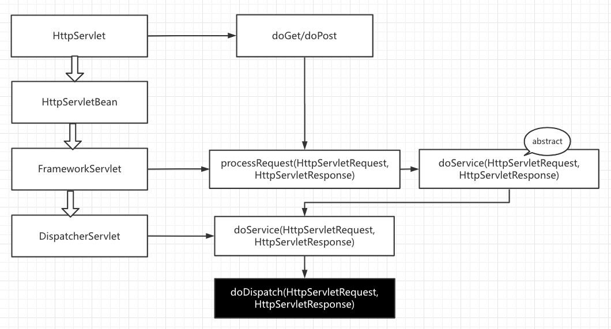

# Spring-web-mvc-principle

## 原理介绍

### Spring Web Mvc

#### 1、前端控制器 DispatcherServlet 结构分析

下图为 *DispatcherServlet* 类的相关继承以及关键方法实现，其中最顶层的类是*HttpServlet*类：当前端发起请求时，主要是靠*HttpServlet*类的doGet/doPost方法处理请求。doGet/doPost方法的相关调用及实现如下图：



> 由图可看出，处理请求最重要的方法是 *DispatherServlet* 中的 doDispatch(HttpServletRequest, HttpServletResponse) 方法

#### 2、请求处理的大概流程

1）前端进行请求后，DispatcherServlet收到请求

2）调用doDispatch()方法进行处理：

- getHandler()：根据当前请求地址在HandlerMapping中找到这个请求的映射信息，获取到目标处理器类（处理类)
- getHandlerAdapter()：根据当前处理器类获取到能执行这个处理器方法的适配器HandlerAdapter
- 使用刚才获取到的适配器（AnnotationMethodHandlerAdapter-注解方法适配器）执行目标方法
- 目标方法执行后，会返回ModelAndView对象
- 根据ModelAndView对象的信息转发到具体的页面，并可以在请求域中取出ModelAndView中的模型数据

> > getHandler()细节：如何根据当前请求找到对应的处理类？
> >
> > ```
> > @Nullable
> > protected HandlerExecutionChain getHandler(HttpServletRequest request) throws Exception {
> >     if (this.handlerMappings != null) {
> >         Iterator var2 = this.handlerMappings.iterator();
> > 
> >         while(var2.hasNext()) {
> >             HandlerMapping mapping = (HandlerMapping)var2.next();
> >             HandlerExecutionChain handler = mapping.getHandler(request);
> >             if (handler != null) {
> >                 return handler;
> >             }
> >        }
> >      }
> > 
> >     return null;
> > }
> > ```
> >
> > getHandler()会返回目标处理器类的执行链（HandlerExecutionChain)
> >
> > HandlerMapping(处理器映射)：保存了每一个处理器能处理哪些请求的映射
> >
> > HandlerMappint中有handlerMap，是在ioc容器启动创建Controller对象时扫描每个处理器都能处理什么请求，并将其保存在HandlerMapping的handlerMap属性中，下一次请求过来，在HandlerMapping中寻找请求映射信息

具体HandlerMapping：https://blog.csdn.net/qq_38410730/article/details/79507465

> > 如何找到目标处理器类的适配器，即找到执行目标方法的适配器。
> >
> > 寻找HandlerAdapter代码：
> >
> > ```
> > protected HandlerAdapter getHandlerAdapter(Object handler) throws ServletException {
> >     if (this.handlerAdapters != null) {
> >         Iterator var2 = this.handlerAdapters.iterator();
> > 
> > 				// 遍历 handlerAdapters
> >         while(var2.hasNext()) {
> >             HandlerAdapter adapter = (HandlerAdapter)var2.next();
> >             if (adapter.supports(handler)) {
> >                 return adapter;
> >             }
> >         }
> >     }
> > 
> >     throw new ServletException("No adapter for handler [" + handler + "]: The DispatcherServlet configuration needs to include a HandlerAdapter that supports this handler");
> > }
> > ```
> >
> > 对于使用注解的方法，拿到AnnotationMethodHandlerAdapter：能解析注解方法的适配器，对于该处理器，处理类中只要有标了注解的这些方法就能使用

#### 3、SpringMVC中的九大组件：DIspatcherServlet中有几个引用类型的属性

> SpringMVC在工作的时候，关键位置都是由这些组件完成

- 文件上传解析器 MultipartResolver
- 区域信息解析器 LocaleResolver (和国际化有关)
- 主题解析器 ThemeResolver（强大的主题效果更换)
- Handler映射信息 HandlerMapping
- Handler的适配器 HandlerAdapter
- 异常解析器 HandlerExceptionResolver 
- 视图名解析器 RequestToViewNameTranslator
- FlashMapManager(SpringMVC中运行重定向携带数据的功能)
- 视图解析器   ViewResolver

九大组件全是接口：接口就是规范，提供了非常强大的拓展性

DispatcherServlet九大组件初始化的地方：

```
protected void onRefresh(ApplicationContext context) {
        this.initStrategies(context);
    }
```

initStrategies方法：

```
protected void initStrategies(ApplicationContext context) {
        this.initMultipartResolver(context);
        this.initLocaleResolver(context);
        this.initThemeResolver(context);
        this.initHandlerMappings(context);
        this.initHandlerAdapters(context);
        this.initHandlerExceptionResolvers(context);
        this.initRequestToViewNameTranslator(context);
        this.initViewResolvers(context);
        this.initFlashMapManager(context);
    }
```


##### 对于初始化HandlerMapping：

```
private void initHandlerMappings(ApplicationContext context) {
        this.handlerMappings = null;
        
        // 是否需要扫描所有的HandlerMapping，默认为true
        if (this.detectAllHandlerMappings) {
        		// 找到 HandlerMapping.class 类的所有后代
            Map<String, HandlerMapping> matchingBeans = BeanFactoryUtils.beansOfTypeIncludingAncestors(context, HandlerMapping.class, true, false);
            // 如果能找到对应的HandlerMapping
            if (!matchingBeans.isEmpty()) {
                this.handlerMappings = new ArrayList(matchingBeans.values());
                AnnotationAwareOrderComparator.sort(this.handlerMappings);
            }
        // 不扫描所有的HandlerMapping
        } else {
            try {
            		// 直接通过getBean方法找到 HandlerMapping.class 的handlerMapping
                HandlerMapping hm = (HandlerMapping)context.getBean("handlerMapping", HandlerMapping.class);
                this.handlerMappings = Collections.singletonList(hm);
            } catch (NoSuchBeanDefinitionException var4) {
            }
        }

				// 如果没有HandlerMapping被找到，获取一个默认的HandlerMapping
        if (this.handlerMappings == null) {
            this.handlerMappings = this.getDefaultStrategies(context, HandlerMapping.class);
            if (this.logger.isTraceEnabled()) {
                this.logger.trace("No HandlerMappings declared for servlet '" + this.getServletName() + "': using default strategies from DispatcherServlet.properties");
            }
        }

        Iterator var6 = this.handlerMappings.iterator();

        while(var6.hasNext()) {
            HandlerMapping mapping = (HandlerMapping)var6.next();
            if (mapping.usesPathPatterns()) {
                this.parseRequestPath = true;
                break;
            }
        }

    }
```

> > 对于 detectAllHandlerMappings 等属性，可以在web.xml中通过修改DispatcherServlet的某些属性进行更改:
> >
> > ```
> > <init-param>
> > 	<param-name>detectAllHandlerMappings</param-name>
> > 	<param-value>false</param-value>
> > </init-param>
> > ```

组件的初始化：去容器中找这个组件，没有找到就使用默认的配置


#####  如何通过HandlerAdapter执行目标方法

```
mv = ha.handle(processedRequest, response, mappedHandler.getHandler());
```

其中，handle方法的代码如下：

```
@Nullable
public final ModelAndView handle(HttpServletRequest request, HttpServletResponse response, Object handler) throws Exception {
    return this.handleInternal(request, response, (HandlerMethod)handler);
}
```

调用了handleInternal(request, response, (HandlerMethod)handler) 方法，这是一个抽象方法：

```
@Nullable
protected abstract ModelAndView handleInternal(HttpServletRequest var1, HttpServletResponse var2, HandlerMethod var3) throws Exception;
```

handleInternal 方法的实现代码如下：

```
protected ModelAndView handleInternal(HttpServletRequest request, HttpServletResponse response, HandlerMethod handlerMethod) throws Exception {
    this.checkRequest(request);
    ModelAndView mav;
    if (this.synchronizeOnSession) {
        HttpSession session = request.getSession(false);
        if (session != null) {
            Object mutex = WebUtils.getSessionMutex(session);
            synchronized(mutex) {
               mav = this.invokeHandlerMethod(request, response, handlerMethod);
            }
        } else {
            mav = this.invokeHandlerMethod(request, response, handlerMethod);
        }
    } else {
        mav = this.invokeHandlerMethod(request, response, handlerMethod);
    }

    if (!response.containsHeader("Cache-Control")) {
        if (this.getSessionAttributesHandler(handlerMethod).hasSessionAttributes()) {
            this.applyCacheSeconds(response, this.cacheSecondsForSessionAttributeHandlers);
        } else {
            this.prepareResponse(response);
        }
    }

    return mav;
}
```

其中，真正执行操作的方法为 *mav = this.invokeHandlerMethod(request, response, handlerMethod);*  

```
@Nullable
protected ModelAndView invokeHandlerMethod(HttpServletRequest request, HttpServletResponse response, HandlerMethod handlerMethod) throws Exception {
    ServletWebRequest webRequest = new ServletWebRequest(request, response);

    Object result;
    try {
        WebDataBinderFactory binderFactory = this.getDataBinderFactory(handlerMethod);
        ModelFactory modelFactory = this.getModelFactory(handlerMethod, binderFactory);
        ServletInvocableHandlerMethod invocableMethod = this.createInvocableHandlerMethod(handlerMethod);
        if (this.argumentResolvers != null) {
            invocableMethod.setHandlerMethodArgumentResolvers(this.argumentResolvers);
        }

        if (this.returnValueHandlers != null) {
            invocableMethod.setHandlerMethodReturnValueHandlers(this.returnValueHandlers);
        }

        invocableMethod.setDataBinderFactory(binderFactory);
        invocableMethod.setParameterNameDiscoverer(this.parameterNameDiscoverer);
        ModelAndViewContainer mavContainer = new ModelAndViewContainer();
        mavContainer.addAllAttributes(RequestContextUtils.getInputFlashMap(request));
        modelFactory.initModel(webRequest, mavContainer, invocableMethod);
        mavContainer.setIgnoreDefaultModelOnRedirect(this.ignoreDefaultModelOnRedirect);
        AsyncWebRequest asyncWebRequest = WebAsyncUtils.createAsyncWebRequest(request, response);
        asyncWebRequest.setTimeout(this.asyncRequestTimeout);
        WebAsyncManager asyncManager = WebAsyncUtils.getAsyncManager(request);
        asyncManager.setTaskExecutor(this.taskExecutor);
        asyncManager.setAsyncWebRequest(asyncWebRequest);
        asyncManager.registerCallableInterceptors(this.callableInterceptors);
        asyncManager.registerDeferredResultInterceptors(this.deferredResultInterceptors);
        if (asyncManager.hasConcurrentResult()) {
            result = asyncManager.getConcurrentResult();
            mavContainer = (ModelAndViewContainer)asyncManager.getConcurrentResultContext()[0];
            asyncManager.clearConcurrentResult();
            LogFormatUtils.traceDebug(this.logger, (traceOn) -> {
                String formatted = LogFormatUtils.formatValue(result, !traceOn);
                return "Resume with async result [" + formatted + "]";
            });
            invocableMethod = invocableMethod.wrapConcurrentResult(result);
        }

        invocableMethod.invokeAndHandle(webRequest, mavContainer, new Object[0]);
        if (!asyncManager.isConcurrentHandlingStarted()) {
            ModelAndView var15 = this.getModelAndView(mavContainer, modelFactory, webRequest);
            return var15;
        }

        result = null;
    } finally {
        webRequest.requestCompleted();
    }

    return (ModelAndView)result;
}
```

执行的具体代码：invocableMethod.invokeAndHandle(webRequest, mavContainer, new Object[0]);

```
		public void invokeAndHandle(ServletWebRequest webRequest, ModelAndViewContainer mavContainer, Object... providedArgs) throws Exception {
        Object returnValue = this.invokeForRequest(webRequest, mavContainer, providedArgs);
        this.setResponseStatus(webRequest);
        if (returnValue == null) {
            if (this.isRequestNotModified(webRequest) || this.getResponseStatus() != null || mavContainer.isRequestHandled()) {
                this.disableContentCachingIfNecessary(webRequest);
                mavContainer.setRequestHandled(true);
                return;
            }
        } else if (StringUtils.hasText(this.getResponseStatusReason())) {
            mavContainer.setRequestHandled(true);
            return;
        }

        mavContainer.setRequestHandled(false);
        Assert.state(this.returnValueHandlers != null, "No return value handlers");

        try {
            this.returnValueHandlers.handleReturnValue(returnValue, this.getReturnValueType(returnValue), mavContainer, webRequest);
        } catch (Exception var6) {
            if (logger.isTraceEnabled()) {
                logger.trace(this.formatErrorForReturnValue(returnValue), var6);
            }

            throw var6;
        }
    }
```


##### 对于参数的处理

1）看是否有注解

2）无注解：

- 看是否为普通参数（resolveCommonArgument)，即确定当前参数是否为原生api
- 判断是否时Model或者Map，如果是，将之前创建的隐形模型进行赋值


#### 3、处理请求的具体过程

1）检查是否为文件上传,checkMulti()

2）获取适配器handlerMapping,getHandler()

- handlerMappings中pathMatcher

3）获取执行方法handlerAdapter

4）执行方法handle(processedRequest, response, mappedHandler.getHandler());

- handleInternal(request, response, (HandleMethod) handler);
- invokeHandlerMethod(request, response, handlerMethod);
- invocableMethod.invokeAndHandle(webrequest, mavContainer);
- invokeForRequest(webrequest, mavContainer, provideArgs);
- getMethodArgumentValues(request, mavContainer, provideArgs);

