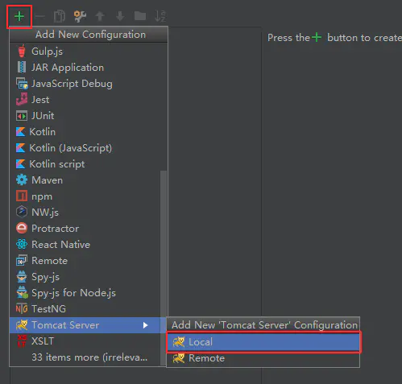

# spring-web-mvc-tutorial

## 简单入门介绍

### Spring Web Mvc

> > 该部分参考：https://www.jianshu.com/p/91a2d0a1e45a

### 一、采用配置方式的Spring MVC

> *示例代码为demo1*

#### 1、在idea中新建Spring MVC项目


创建完成后，项目结构如下：


#### 2、修改web.xml

打开web.xml，把`<url-pattern>`元素的值改为 / ，表示要拦截所有的请求，并交由Spring MVC的后台控制器来处理，改完之后：

```
<servlet-mapping>
    <servlet-name>dispatcher</servlet-name>
    <url-pattern>/</url-pattern>
</servlet-mapping>
```

修改说明如图：


#### 3、编辑dispatcher-servlet.xml

`WEB-INF`目录下默认有一个`dispatcher-servlet.xml`文件，该文件的文件名`xxxx-servlet.xml`中的`xxxx`与`web.xml`中`servlet-name`中名称保持一致，默认web.xml中servlet相关配置代码如下：

```
<servlet>
	<servlet-name>dispatcher</servlet-name>
	<servlet-class>org.springframework.web.servlet.DispatcherServlet</servlet-class>
	<load-on-startup>1</load-on-startup>
</servlet>
```

修改`dispatcher-servlet.xml`文件内容如下：

```
<?xml version="1.0" encoding="UTF-8"?>
<beans xmlns="http://www.springframework.org/schema/beans"
       xmlns:xsi="http://www.w3.org/2001/XMLSchema-instance"
       xsi:schemaLocation="http://www.springframework.org/schema/beans http://www.springframework.org/schema/beans/spring-beans.xsd">

    <bean id="simpleUrlHandlerMapping"
          class="org.springframework.web.servlet.handler.SimpleUrlHandlerMapping">
        <property name="mappings">
            <props>
                <!-- /hello 路径的请求交给 id 为 helloController 的控制器处理-->
                <prop key="/hello">helloController</prop>
            </props>
        </property>
    </bean>
    
    <!-- id 为 helloController 的控制器相关映射 -->
    <bean id="helloController" class="controller.HelloController"></bean>
    
</beans>
```


#### 4、编写HelloController

在 Package【controller】下创建 【HelloController】类，实现org.springframework.web.servlet.mvc.Controller 接口：

```
package controller;

import org.springframework.web.servlet.ModelAndView;
import org.springframework.web.servlet.mvc.Controller;

public class HelloController implements Controller{
    @Override
    public ModelAndView handleRequest(javax.servlet.http.HttpServletRequest httpServletRequest, javax.servlet.http.HttpServletResponse httpServletResponse) throws Exception {
        return null;
    }
}
```

> > 出现javax.servlet 包找不到的问题，将本地 Tomcat 服务器的目录下【lib】文件夹下的 servlet-api.jar 包拷贝到工程【lib】文件夹下，并添加依赖

> Spring MVC 通过 ModelAndView 对象把模型和视图结合在一起
>
> ```
> ModelAndView mav = new ModelAndView("index.jsp");
> mav.addObject("message", "Hello Spring MVC");
> ```
>
> 这里表示视图的是index.jsp，模型数据的是 message，内容是 “Hello Spring MVC”


#### 5、准备index.jsp

修改index.jsp的内容为：

```
<%@ page language="java" contentType="text/html; charset=UTF-8"
    pageEncoding="UTF-8" isELIgnored="false"%>
 
<h1>${message}</h1>
```


#### 6、准备tomcat

> *要先在本地或者远端服务器上安装好tomcat*

在【Run】菜单项下找到【Edit Configurations】：


配置 Tomcat 环境：



选择好本地的 Tomcat 服务器，并改好名字：


在 Deployment 标签页下完成如下操作：


点击运行，可以在浏览器查看结果


#### 7、tomcat部署出错

tomcat报错时，因为看不到具体的报错信息，可以在`WEB-INF`目录下添加`classes`文件夹，并在文件夹中添加`logging.properties`文件，文件内容如下：

```
handlers = org.apache.juli.FileHandler, java.util.logging.ConsoleHandler

############################################################
# Handler specific properties.
# Describes specific configuration info for Handlers.
############################################################

org.apache.juli.FileHandler.level = FINE
org.apache.juli.FileHandler.directory = ${catalina.base}/logs
org.apache.juli.FileHandler.prefix = error-debug.

java.util.logging.ConsoleHandler.level = FINE
java.util.logging.ConsoleHandler.formatter = java.util.logging.SimpleFormatter
```

再次点击运行，可以看到tomcat报错信息。

报错信息为`org.springframework.web.context.ContextLoaderListener`错误时，是因为spring监听器缺失，是jar包没有同步发布到项目中进行运行，导致项目运行找不到spring的jar包，解决方法为： 

项目右键–properties----Deployment----加入maven dependencies这些jar包


### 二、采用注解方式的Spring MVC

> *示例代码为demo2*

#### 1、修改 HelloController 的代码

在demo1的基础上，将HelloController的代码修改为如下：

```
package controller;

import org.springframework.stereotype.Controller;
import org.springframework.web.bind.annotation.RequestMapping;
import org.springframework.web.servlet.ModelAndView;

@Controller
public class HelloController{
    @RequestMapping("/hello")
    public ModelAndView handleRequest(javax.servlet.http.HttpServletRequest httpServletRequest, javax.servlet.http.HttpServletResponse httpServletResponse) throws Exception {
        ModelAndView mav = new ModelAndView("index.jsp");
        mav.addObject("message", "Hello Spring MVC");
        return mav;
    }
}
```


#### 2、修改 dispatcher-servlet.xml 相关配置

在 dispatcher-servlet.xml 文件中，注释掉之前的配置，然后增加一句组件扫描：

```
<?xml version="1.0" encoding="UTF-8"?>
<beans xmlns="http://www.springframework.org/schema/beans"
       xmlns:xsi="http://www.w3.org/2001/XMLSchema-instance"
       xmlns:context="http://www.springframework.org/schema/context"
       xsi:schemaLocation="http://www.springframework.org/schema/beans http://www.springframework.org/schema/beans/spring-beans.xsd http://www.springframework.org/schema/context https://www.springframework.org/schema/context/spring-context.xsd">
<!--    <bean id="simpleUrlHandlerMapping"-->
<!--          class="org.springframework.web.servlet.handler.SimpleUrlHandlerMapping">-->
<!--        <property name="mappings">-->
<!--            <props>-->
<!--                &lt;!&ndash; /hello 路径的请求交给 id 为 helloController 的控制器处理&ndash;&gt;-->
<!--                <prop key="/hello">helloController</prop>-->
<!--            </props>-->
<!--        </property>-->
<!--    </bean>-->
<!--    <bean id="helloController" class="controller.HelloController"></bean>-->

    <!-- 扫描controller下的组件 -->
    <context:component-scan base-package="controller"/>
</beans>
```


#### 3、重启项目

重启后，看到仍然和之前一样。


## 原理介绍

### Spring Web Mvc

